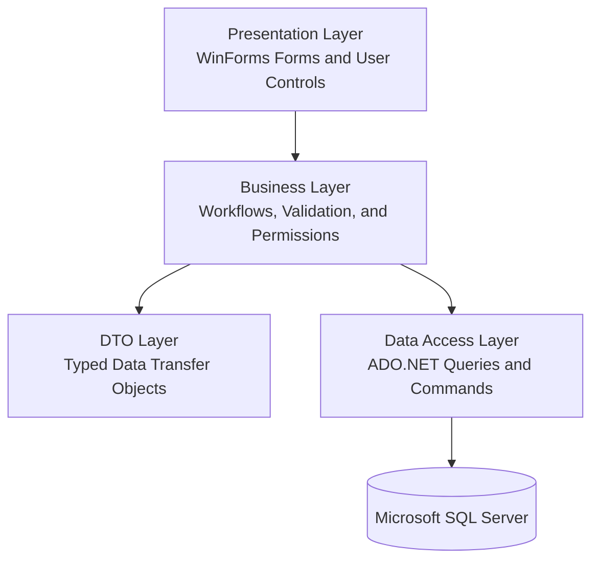
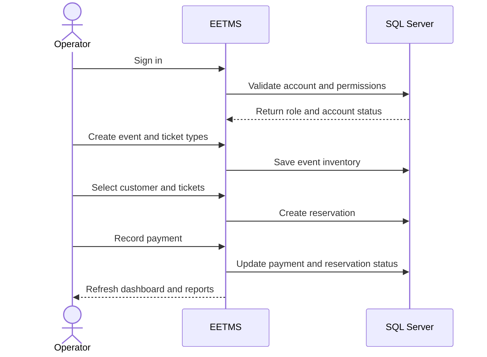

# 🎟️ ENTERPRISE EVENT & TICKETING MANAGEMENT SYSTEM

> **A professional Windows desktop platform for managing events, ticket inventory, customer reservations, payments, users, permissions, and business performance.**

<div align="center">

[](https://learn.microsoft.com/dotnet/csharp/)
[](https://dotnet.microsoft.com/download/dotnet-framework/net48)
[](https://www.microsoft.com/windows)
[](https://www.microsoft.com/sql-server)
[](https://learn.microsoft.com/dotnet/framework/data/adonet/)


</div>

---

# 📖 OVERVIEW

**EETMS** is a centralized event and ticket management system built for organizations that plan events, sell tickets, manage reservations, collect payments, and monitor operational performance.

The application brings the complete ticketing lifecycle into one workspace. Instead of maintaining separate spreadsheets for events, ticket quantities, customers, bookings, and payments, operators can manage the entire workflow through connected modules backed by Microsoft SQL Server.

## 🎯 THE BUSINESS PROBLEM

Event operations require more than creating an event and selling a ticket. Operators need to define ticket categories, control inventory, find customers, calculate booking totals, collect payments, track outstanding balances, control employee access, and understand which events are performing well.

EETMS addresses these needs through a structured Windows Forms interface and a layered architecture that separates presentation, business rules, data access, and data transfer models.

## 🚀 THE COMPLETE WORKFLOW

```text
🎪 Create an event
        ↓
🎫 Define ticket types, prices, and quantities
        ↓
👥 Find or register a customer
        ↓
🛒 Create a reservation
        ↓
🧮 Calculate subtotal, tax, and total
        ↓
💳 Record the payment
        ↓
📌 Track status and remaining balance
        ↓
📊 Review revenue and event performance
```

> 💡 **EETMS connects inventory, customers, reservations, payments, permissions, and analytics in one operational system.**

---

## 🌟 VALUE AT A GLANCE

| Area | What EETMS provides |
|---|---|
| 🎪 Event operations | Create, update, categorize, and manage events. |
| 🎫 Ticket inventory | Define ticket types, prices, quantities, availability, and sales. |
| 👥 Customer records | Search and maintain customers connected to reservations. |
| 🛒 Reservations | Follow a guided booking flow with automatic calculations. |
| 💳 Payments | Record cash, card, or bank-transfer payments. |
| 🔐 Access control | Manage users, roles, permissions, and account status. |
| 📊 Analytics | Monitor revenue, sold tickets, active events, and customers. |
| 📈 Reporting | Review event, category, customer, and payment performance. |

---

# ✨ FEATURES

<details open>
<summary><strong>📊 Dashboard and business overview</strong></summary>

The dashboard gives operators a fast overview of the current business state without opening multiple screens.

**Key indicators**

- 💰 Total revenue.
- 🎟️ Sold tickets.
- 🎪 Active events.
- 👥 Total customers.

**Visual analytics**

- 🗂️ Tickets grouped by category.
- 📈 Monthly revenue analysis.
- 📅 Revenue filtering by year.
- ✨ Animated KPI values.

</details>

<details>
<summary><strong>🎪 Event management</strong></summary>

The event module manages the core records that drive the ticketing workflow.

- ➕ Create new events.
- ✏️ Update event information.
- 🗑️ Delete events when permitted.
- 🗂️ Associate events with categories.
- 📅 Maintain event details.
- 🎫 Open ticket-type management for each event.

</details>

<details>
<summary><strong>🎫 Ticket types and inventory</strong></summary>

Each event can contain multiple ticket types with independent prices and quantities.

| Inventory field | Purpose |
|---|---|
| 🏷️ Ticket type | Identifies the ticket category. |
| 💵 Price | Defines the price of one ticket. |
| 📦 Quantity | Stores the original available quantity. |
| 📉 Available | Shows the remaining quantity. |
| 📈 Current sales | Shows how many tickets were sold. |
| 🚦 Status | Indicates the current availability condition. |

The workflow supports pricing tiers such as **Regular**, **VIP**, and **Premium**.

</details>

<details>
<summary><strong>👥 Customer management</strong></summary>

Customer information is stored centrally and can be reused throughout the reservation workflow.

- ➕ Add customers.
- ✏️ Update customer information.
- 🔍 Search by name or identifier.
- 📋 Browse customer records in data grids.
- 🔗 Connect customers to reservations.
- ♻️ Avoid entering the same customer information repeatedly.

</details>

<details>
<summary><strong>🛒 Guided reservation workflow</strong></summary>

The reservation interface guides the operator through a clear multi-step booking process:

```text
1️⃣ Select customer
        ↓
2️⃣ Select event
        ↓
3️⃣ Select ticket types
        ↓
4️⃣ Choose quantities
        ↓
5️⃣ Review booking summary
        ↓
6️⃣ Confirm reservation
```

Before confirmation, the system displays:

- 🎟️ Quantity for each ticket type.
- 💵 Price per ticket type.
- 🧮 Subtotal.
- 🧾 Tax percentage and tax amount.
- 💰 Final total.
- 📌 Remaining ticket availability.

</details>

<details>
<summary><strong>💳 Payments and financial tracking</strong></summary>

The payment module links financial activity to reservations and keeps balances visible.

**Supported payment methods**

- 💵 Cash.
- 💳 Card.
- 🏦 Bank transfer.

**Tracked payment information**

- 🧾 Reservation identifier.
- 👥 Customer information.
- 💰 Total amount.
- ✅ Paid amount.
- 📌 Remaining balance.
- 📅 Payment date.
- 🏷️ Payment method.
- 🚦 Payment status.

| Status | Meaning |
|---|---|
| ✅ **Paid** | The full reservation amount has been received. |
| 🟠 **Partially paid** | A payment exists, but a balance remains. |
| 🔴 **Unpaid** | No payment has been recorded. |

</details>

<details>
<summary><strong>👤 Users, roles, and permissions</strong></summary>

The administration module controls who can access the system and which operations they can perform.

- 👤 Create and update user accounts.
- 🧩 Assign roles.
- 🛡️ Check permissions for protected actions.
- ✅ Activate accounts.
- 🚫 Deactivate or block accounts.
- 🔢 Track login attempts.
- 📊 Display users, active administrators, and blocked accounts.

</details>

<details>
<summary><strong>📈 Reports and event performance</strong></summary>

The reporting module turns stored operational data into practical business information.

- 🎪 Event performance reports.
- 💰 Revenue by event.
- 🗂️ Ticket category statistics.
- 👥 Customer payment totals.
- 📊 Reservation and transaction summaries.
- 🔍 Searchable and filterable report tables.

</details>

---

# 🏗️ ARCHITECTURE

EETMS follows a layered architecture. Each layer has a focused responsibility, which keeps the application easier to understand, maintain, and extend.



## 🧱 LAYER RESPONSIBILITIES

| Layer | Responsibility | Examples |
|---|---|---|
| `EETMS_Presentation` | Screens, forms, user controls, event handlers, and visual feedback | Dashboard, Events, Customers, Tickets, Payments, Reports |
| `EETMS_BusinessLayer` | Workflows, validation, application rules, and permissions | `EventBL`, `TicketBL`, `PaymentsBL`, `RolesBL` |
| `EETMS_DataAccessLayer` | SQL Server queries, inserts, updates, and deletes through ADO.NET | Event, Ticket, Reservation, Payment, User, and Report DAL modules |
| `EETMS_DTOs` | Structured data exchanged between application layers | `EventDTO`, `CustomerDTO`, `PaymentDTO`, `ReservationTicketsDTO` |

---

## 🗂️ PROJECT STRUCTURE

```text
EETMS/
│
├── EETMS_Presentation/
│   ├── EETMS_Dashboard/          # KPIs, charts, and statistics
│   ├── EETMS_Events/             # Events and ticket types
│   ├── EETMS_Customers/          # Customer records and search
│   ├── EETMS_Tickets/            # Reservations and ticket selection
│   ├── EETMS_Payment/            # Payments and transaction history
│   ├── EETMS_Report/             # Business and event reports
│   ├── EETMS_User/               # Users, roles, and permissions
│   └── EETMS_Main/               # Main application shell
│
├── EETMS_BusinessLayer/
│   ├── Event Business Layer
│   ├── Ticket Business Layer
│   ├── Reservation Business Layer
│   ├── Payment Business Layer
│   ├── Customer Business Layer
│   ├── Country Business Layer
│   ├── Roles Business Layer
│   └── Validation
│
├── EETMS_DataAccessLayer/
│   ├── Query modules
│   ├── Command modules
│   ├── Dashboard data access
│   ├── Report data access
│   └── Reservation-payment data access
│
└── EETMS_DTOs/
    ├── Event DTOs
    ├── Ticket DTOs
    ├── Customer DTOs
    ├── Reservation DTOs
    ├── Payment DTOs
    ├── User DTOs
    └── Role DTOs
```

---

# 🛠️ TECHNOLOGY STACK

| Category | Technology | Purpose |
|---|---|---|
| 💻 Language | C# | Core application language |
| 🪟 Platform | Windows | Desktop execution environment |
| 🧰 Framework | .NET Framework 4.8 | Application runtime |
| 🎨 UI | Windows Forms | Desktop user interface |
| ✨ UI components | Guna.UI2.WinForms | Modern controls, panels, buttons, and styling |
| 📊 Charts | Guna.Charts.WinForms | Dashboard visualizations |
| 🔗 Data access | ADO.NET | SQL Server connectivity and commands |
| 🗄️ Database | Microsoft SQL Server | Persistent business data |
| 🧱 Design | Layered architecture | Separation of responsibilities |
| 📦 Data transfer | DTO pattern | Structured communication between layers |

---

# 🔄 COMPLETE USAGE FLOW



---

# ⚡ GETTING STARTED

### ✅ PREREQUISITES

- Windows operating system.
- Visual Studio with the **.NET desktop development** workload.
- .NET Framework 4.8 Developer Pack.
- Microsoft SQL Server.
- Required Guna UI and chart assemblies.
- EETMS database schema and seed data.

## 1️⃣ CLONE THE REPOSITORY

```bash
git clone https://github.com/<your-username>/<your-repository>.git
cd <your-repository>
```

## 2️⃣ CONFIGURE THE DATABASE CONNECTION

The data access layer reads the connection string named `ConnectionString` from the startup project's configuration file.

```xml
<configuration>
  <connectionStrings>
    <add name="ConnectionString"
         connectionString="Data Source=YOUR_SERVER;Initial Catalog=EETMS;Integrated Security=True;TrustServerCertificate=True"
         providerName="System.Data.SqlClient" />
  </connectionStrings>
</configuration>
```

Replace `YOUR_SERVER` with your SQL Server instance.

> ⚠️ Never commit production passwords, private connection strings, or secrets to GitHub.

### 3️⃣ BUILD AND RUN

1. Open the Visual Studio solution.
2. Restore or add the required project references and packages.
3. Set the presentation project as the startup project.
4. Start SQL Server and confirm that the database exists.
5. Verify the `ConnectionString` value.
6. Build the solution.
7. Press `F5` to run the application.

<details>
<summary>🔍 Repository preparation note</summary>

For a fully reproducible repository, include these files when they are not already present:

- `EETMS.sln`.
- Database schema and seed scripts.
- `App.config.example` with safe placeholders.
- NuGet package configuration or SDK package references.
- `.gitignore` for Visual Studio generated files.
- `LICENSE`.

</details>

---

# 🔐 SECURITY

The source code includes several security-oriented behaviors:

- 🔑 Password complexity validation.
- 📧 Email format validation.
- 🚫 Username input validation.
- 🔢 Login-attempt limits.
- 👤 Active and inactive account states.
- 🛡️ Role and permission checks.
- 🔗 Parameterized SQL commands.

### 🚨 PRODUCTION HARDENING

Before using the application in a production environment:

- Hash passwords with a modern salted algorithm such as **Argon2id**, **scrypt**, or **PBKDF2**.
- Keep connection strings and secrets outside source control.
- Use a least-privilege SQL Server account.
- Enforce authorization in the business layer and database boundary.
- Add audit logs for payments, reservations, user changes, and administrative actions.
- Replace raw database exceptions with safe, user-friendly messages.

---

# 🧠 DATA INTEGRITY

Reservations and payments affect both ticket inventory and financial records. Multi-step booking operations should be executed inside one database transaction:

```text
Create reservation
        +
Reserve ticket quantity
        +
Record payment
        +
Update reservation status
        =
One atomic operation
```

This approach helps prevent incomplete bookings, incorrect balances, and ticket overselling when multiple operators work at the same time.

---

# 📄 LICENSE

This project is released under a **personal, non-commercial educational license**.

Copyright (c) 2026 **Ahmed Jehad**.

### ✅ You may

- View the source code.
- Learn from the project.
- Modify it for personal, non-commercial learning.

### 🚫 You may not

- Use the project for commercial purposes or profit.
- Sell or distribute it as your own.
- Claim it as your original work.
- Use it for purposes other than personal learning and study.

Read the complete terms in the LICENSE file.

<!--
Before publishing:
- Replace the placeholder repository URL.
- Add the Visual Studio solution file.
- Add database scripts.
- Add App.config.example.
- Add .gitignore.
- Remove bin/, obj/, Debug/, Release/, and user-specific files.
- Never upload passwords or production connection strings.
-->

